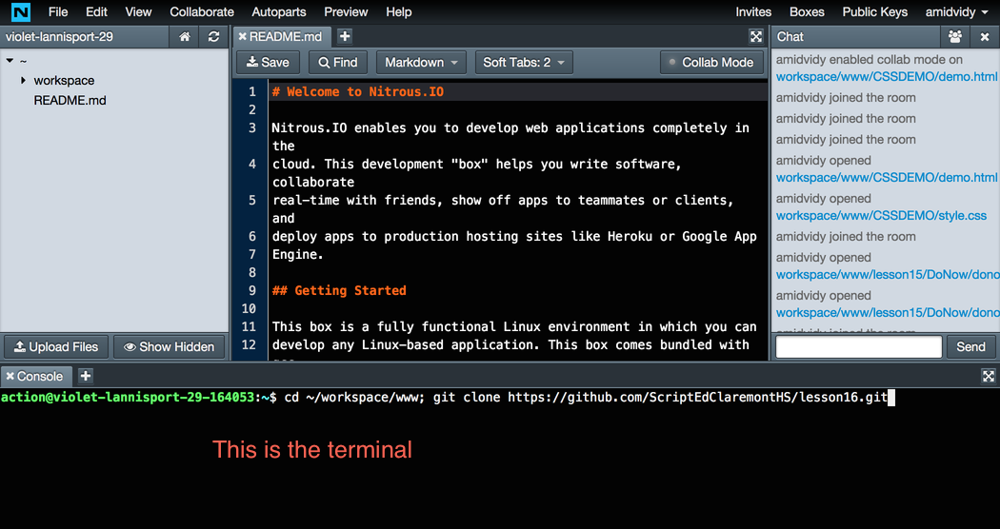
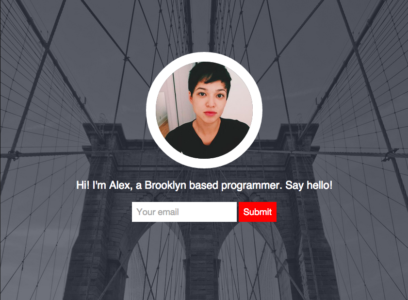

Lesson 16 - CSS Concepts Continued
========

###Do Now

1. Open your Nitrous account
2. Copy and paste this command into your Nitrous Terminal:

  ```
  cd ~/workspace/www; git clone https://github.com/ScriptEdClaremontHS/lesson16.git
  ```



3. Follow the instructions in `donow.html` in the `lesson16/DoNow` folder

###Bonus Challenge

1. Find `bonus.html` and `bonus.css` in `lesson16/BonusChallenge`
2. Write the HTML and CSS for this webpage, but use your own text and images!

 

* Hint 1: There is a **text field** and a **button** on the page!
* Hint 2: One image on the page has a `border-radius` and a `border`
* Hint 3: If you don't know how to do something, Google it! Example Google search: `button HTML`
